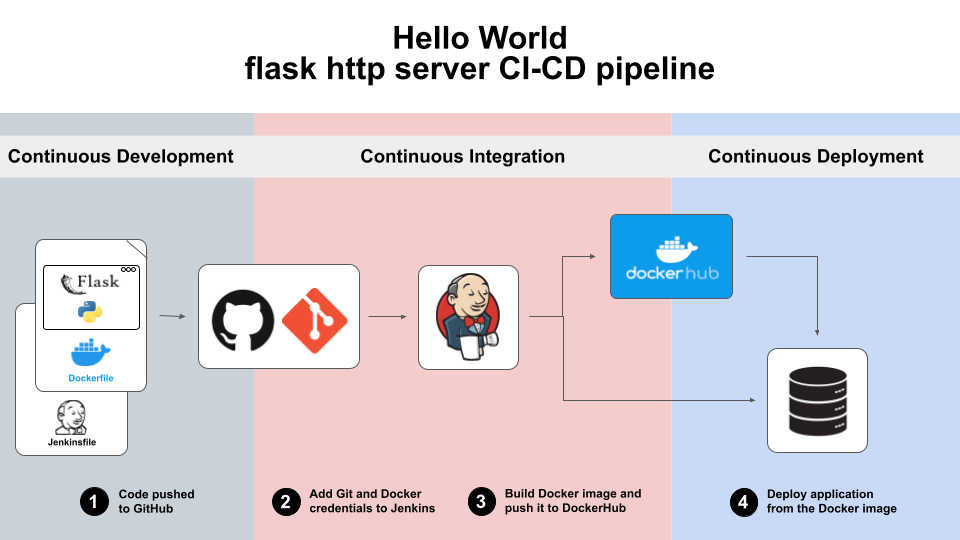

# Devops Project

## Goal
The goal is to create a debian-based server with manual and automatized installation and deploy the application on it with Jenkins CI-CD pipeline.

IMPORTANT NOTE: Please note that the project does not contain the virtual machine image and the vagrant-ansible automation just partially tested.

You can find the hello-flask-app docker image on dockerhub: https://hub.docker.com/repository/docker/matekassa/hello-flask-app/general

Please check the documentation for more details: https://gist.github.com/matekassa/cf4593322d4b4695fd6e556c6d203803